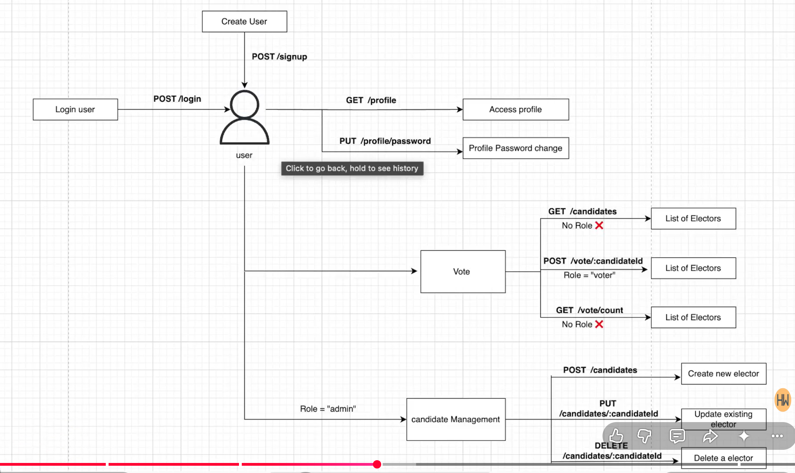

voting application

WHAT???
A functionality where user can give vote to the given set of candidates

models???
routes???

voting app functionality

1. users sigup / signin
2. see list of candidates
3. vote  one of the candidates
4. There is a route which shows list of candidates and their live vote counts sorted by their vote count 
5. User data must contain thier one unique govt id proof named : voter id number
6. there should be only one admin who can only manage the table of candidates and he wont have access to vote at all.
7. user can change their password
8. User can only login with their voter id number and password

==================================================================================================================================

Routes

User Authentication:
    /signup: POST – Create a new user account.
    /login: POST – Log in to an existing account.

Voting:
    /candidates: GET – Get the list of candidates.
    /vote/:candidateId: POST – Vote for a specific candidate. (voter id + password)

Vote Counts:
    /vote/counts: GET – Get the list of candidates sorted by their vote counts.

User Profile:
    /profile: GET – Get the user's profile information.
    /profile/password: PUT – Change the user's password.

Admin Candidate Management:
    /candidates: POST – Create a new candidate.
    /candidates/:candidateId: PUT – Update an existing candidate.
    /candidates/:candidateId: DELETE – Delete a candidate from the list.

    